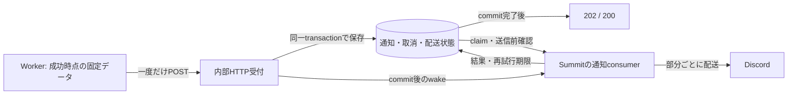

# MOM-18 実施計画

作成日: 2026-09-09。状態: 実装中。業務ルールと集約の更新境界をアプリケーション側へ移す方針で、MOM-14・momo-resultを含む修正範囲も承認済み。

対象: [MOM-18: 通知Webhookを永続受付し、Discord配送・再送をSummitで担う](https://linear.app/ponta/issue/MOM-18)。ユーザーは基準準備後の実装・検証・適宜commitまで依頼済み。DBに業務ルールを実装しないという追加方針を優先し、従来の通知SQL関数を呼び出すだけの実装は行わない。

本書は着手から受け入れまでの作業を管理する。仕様を独立して定義する正本にはしない。実装完了時に確定した契約を既存の要求・設計・runbookへ反映し、計画の役割が終わったら本書を整理する。

## 1. チケットの理解

Workerが成功時点で固定したA/Bのデータを一度だけ送信し、SummitがDBへ保存した後の配送責任を引き受ける。中心となる境界は、HTTP受信やメモリ上のqueue投入ではなく、受付transactionのcommitである。

- **A: OCR完了**。画像ごとの成功・要確認、画像種別、要約、処理日時、下書きへの導線を表示する。未確定の順位・金額、OCR生テキスト、画像、失敗通知は含めない。
- **B: 分析完了**。成功した論理分析ジョブ単位に、追加・変更試合の順位、前回成功分析→今回の作品通算・シーズン通算、対象数・差分、通知内の銀次、メモ全文、確認導線を表示する。
- 本文は保存済みpayloadから描画する。平均順位の再計算、最新の表示名・メモ・試合データによる差し替えは行わない。
- 受付前の停止・通信失敗では通知が欠落し得る。受付後は同じ通知を回収・再送する。Workerのtimeoutだけで未受付と断定しない。
- OFF、設定世代不一致、Aの下書き確定・取消・削除、Bの掲載試合削除は取消条件。Bは通知単位で取り消す。再ONや再起動でも復活させない。
- 分割途中の取消では配送済み部分を残し、未開始部分を取り消す。送信開始済みの部分は届き得る。投稿済み内容を後から削除・編集して帳尻を合わせない。
- 通常の重複受信による新規配送は防止する。Discordの送達不明を経た再送では重複があり得る。
- 正常時の横断目標は、Aの成功保存／Bの分析公開・再利用成功から1分以内。Summitの通常経路は受付直後に起動し、supervisor待ちにしない。

根拠: [通知要件・仕様](https://linear.app/ponta/document/discord通知-要件仕様ocr完了分析完了-59da567fe5ba)、[採用方式・連携契約](https://linear.app/ponta/document/discord通知の採用方式連携契約-7830c9e66f29)。

## 2. 調査で確定した前提と分担

| 対象 | 確認できた状態 | 計画への反映 |
| --- | --- | --- |
| Summitの作業branch | `feat/mom-18-notifications`。`5fc528b`から作成 | MOM-14の既存アンケート対応を含む基準で作業する |
| MOM-14のSummit対応 | `feat/mom-14-shared-notifications`、`5fc528b`。元のmaster `8a19c85`に対して1 commit先 | MOM-18のbranchに取り込み済み |
| momo-db | ローカルmasterは`e719f73` | この共有契約または互換な後続commitを使う |
| MOM-14の進行状態 | LinearはIn Review。共有契約とローカル検証の完了報告がある | 報告済み検証と、今回実行する検証を区別する |
| 共有DB契約 | 保存構造に加え、設定・取消・受付・再試行の業務ルールもSQL関数・triggerに含まれる | 業務ルールをアプリケーション側へ移す契約改訂が必要。既存関数の呼出しを実装基準にしない |
| 既存Summit consumer | MOM-14の`OutboxPort`は`family=attendance`に限定 | Sessionの順序、後続取消、最新状態rendererをA/Bへ流用しない |
| scheduler | one-shot timer、受付以外のwake、作業中のburst、低頻度supervisorがある | A/Bのwake・次回時刻・回収を接続する |
| 新規部分 | 固定payloadのrendererを先行実装。内部HTTP受付、A/B consumer、運用への接続は未実装 | DB契約の修正と独立した表示検証を進める |
| CIの依存取得 | Summit CIはmomo-dbの既定branchをcheckoutする。GitHub上のmasterは`fca0e42`で、必要な`e719f73`の取得は404 | ローカル検証を進める。リモートCIは依存commitの共有後に確認する |

基準準備時の検証と結果（MOM-18の追加実装を検証した結果ではない）:

| 対象 | 結果 |
| --- | --- |
| 依存package | 固定されたNode.js・pnpmで`pnpm install --frozen-lockfile`が成功。lockfileの変更なし |
| momo-dbのbuild | `pnpm build`が成功。Summitに導入済みの`@momo/db`が`e719f73`のbuild結果と一致 |
| DBの実装基準 | 専用の一時PostgreSQL 18へ`pnpm test:prepare`で44件のmigrationを適用。共有通知の6 table・24関数を確認 |
| Summitの品質gate | `pnpm run ci`が成功。54 file・327 testが成功し、型・lint・未使用code・build・文書・禁止patternも合格 |
| DB integration | `pnpm test:integration`が成功。8 file・33 testが成功 |
| 文書の最終確認 | 計画書の更新後に`pnpm verify:docs`と`git diff --check`を確認 |

基準準備時に導入済み`@momo/db`で欠けていた`notifications`の生成fileは、lockfileどおりの再installで揃えた。その時点では追跡対象のcode・依存定義・migrationに追加修正はない。file-size検査には既存の`src/scheduler/controller.ts`について312行のadvisoryが1件あった。

基準検証はgit管理対象と本計画書の一時コピーで実施し、dummy設定と専用DBを使用した。検証用PostgreSQLは終了後に破棄した。実際のlocal secret・保存対象DBは使用していない。DB側の業務ルールを採用する前提は変更されており、契約を改訂してからconsumerを接続する。リモートCIの確認には依存commitの共有も必要。

共有契約の正本はmomo-dbの`docs/discord-notifications.md`、`src/schema.ts`、`src/notifications.ts`。payload例は`docs/examples/ocr-completed-v1.json`と`analysis-completed-v1.json`。

現行のMOM-18本文・初期連携文書には、MOM-14の共通保存への切替前の説明が残る。保存済みidentity・取消・部分配送・保持の意味は維持し、業務判断の実装場所を改訂する。現在のmomo-db文書は改訂前の実装を説明しているため、そのSQL関数・triggerを今後も採用する根拠にはしない。

MOM-15が設定画面・API、MOM-16がOCR producerと共通HTTP送信部、MOM-17が分析snapshotとproducerを担当する。MOM-18ではそれらの実装を取り込まず、共有payloadとfixtureを使って受信側を完成させる。実際のWorker・6PN・Discordを通した受け入れは[MOM-19](https://linear.app/ponta/issue/MOM-19)へ引き渡す。

## 3. ユーザー確認で確定した事項

| 項目 | 現状と採用理由 | 確定した方針 |
| --- | --- | --- |
| Bの確認リンク | 現在のWebは作品の最新分析を表示する。既存の認証付き画面を利用する | Discord本文に分析時点を明記し、「最新の分析を確認」と対象試合の詳細へリンクする |
| 運用の状態確認・再試行 | 通知IDを指定する運用操作として扱う | 運用コマンドとrunbookで、通知IDによる状態確認・同じ通知の明示再試行を行う |
| 業務ルールの実装場所 | 現行MOM-14のSQL関数・triggerが業務判断を持っている | 通知の可否・取消・再試行などの判断はアプリケーション側へ置く。DBの一意制約・外部キー・transaction・排他は維持する |

2026-09-09にユーザーが両方の推奨案を承認した。通知本文の固定とリンク先の最新表示を区別し、通知時点の分析を固定して開く画面やDiscord管理者コマンドは追加しない。

リンク調査の根拠: momo-resultの`apps/web/src/app/router.tsx`、`features/seriesComparison/page/useSeriesAnalysisResource.ts`、`features/seriesComparison/navigation/useSeriesAnalysisLocationState.ts`。Aの`/review/:matchSessionId`は実際にmatch draft IDを受け取る。

## 4. 実施手順

### 0. DB側の業務ルールを移す修正範囲を確定する

- 承認済みの追加対象は、momo-dbの通知関数・trigger、Summitの既存アンケートconsumer、momo-resultの下書き確定・取消・削除と試合削除の処理。
- 通知可否、設定世代、取消理由、payloadの業務検証、状態遷移、再試行・保持の方針をアプリケーション側で判断する。DB関数を別名の業務procedureへ置き換えない。
- DBでは一意性・参照整合性を制約で守る。どの処理を一つの集約更新として確定するか、何をどの順序でlockするかはアプリケーションのcommandとrepositoryに明示する。業務側の変更と通知取消を同じtransactionに含める接続を、triggerを撤去する前に揃える。
- 撤去はmomo-dbの正規migrationで行う。既存の共有済みmigrationを書き換えず、保存済みpayload・identity・送達証跡・取消状態を保つ。
- 設定・成功時snapshotを取得するAPI/Worker向けの連携契約も更新する。言語を跨ぐ処理をTypeScript packageの利用で代替できると仮定しない。
- 対象変更・受付・送信開始の競合、OFF→ON、古いclaim、再起動、途中配送、保持後のdedupeをアプリケーションとreal DBの接続で再検証する。

**完了条件:** 業務判断の所有者と全書込経路が確定し、通知の意味を変えずにDB側の業務関数・triggerを撤去できる。

### 1. 修正後の共有契約に合わせてadapterを整える

完了済みの実装基準準備を出発点にし、手順0の契約改訂を反映してから共有adapterを追加する。

- `5fc528b`を含むMOM-18用branchで作業し、改訂後のmomo-dbの共有型・export・schemaとconsumerが揃っていることを確認する。
- `AppPorts`へA/B専用の通知portを追加する。受付、claim、parts計画、送信開始、結果確定、失敗、期限延長、次回時刻、期限切れ回収、状態照会、手動再試行、保持を必要な責務でまとめる。
- 業務判断はアプリケーション側のpure policy、永続化とtransactionは`src/db/repositories/`へ置く。handlerやschedulerからSQLへ直接アクセスしない。fakeも同じ契約で更新する。
- A/B IDは共有の`result:<kind>:<sourceJobId>`に従い、内容照合はDBのhashを使用する。独自hashや別inboxへ本文を複製しない。
- DB側の業務関数・triggerを撤去するmigrationはmomo-db側で扱う。追加のschema変更は、維持する不変条件と不足する保存契約から判断する。

**完了条件:** 改訂後の保存契約をreal/fake portで扱え、既存attendanceとのfamily混同を防げる。

### 2. 内部HTTPと永続受付を実装する

- Node.js標準HTTPを基本案とし、`src/http/`にlistener・認証・制限、feature側に通知の受付処理を配置する。
- `POST /internal/notifications`で専用Bearer、JSON形式、envelope、version、ID、構造・サイズを検証する。任意の投稿先、URL、本文コマンドは受け付けない。
- payloadをcoerce・補完・項目削除して内容照合を変えない。既存IDの内容照合と、新規payloadのversion検証の順序をアプリケーション側の受付契約として維持する。
- request byte数、同時受付数、読み込み・DB待ち時間を制限する。DB側のJSONBサイズ上限とHTTP側の制限の関係を明文化し、正常な複数試合・メモを通す。
- 短いtransaction内でアプリケーション側が検証・受付・取消判定と保存を行い、commit完了後だけ受付結果を返す。commit後の切断やwake失敗でも、保存済み通知を失敗扱いに変更しない。
- 本番bindは`fly-local-6pn`または6PN IPv6。ローカルtestはloopbackを明示する。既存Machine内で起動し、公開HTTPサービスを追加しない。[Flyのprivate networking仕様](https://fly.io/docs/networking/private-networking/)
- 専用token、bind、port、リンクの許可originを既存の設定境界に配置する。secretの実値は求めず、exampleにはplaceholderを置く。
- 受付の準備状態はDBへ保存できることを基準にする。起動準備中・停止中は拒否し、稼働開始後のDiscord一時不調だけで永続受付を失わない構造にする。
- shutdownは新規受付・新規配送停止→進行中受付と送信の上限付き待機→DB・client終了の順にする。締切内に終わらない未完了通知はDBから回収できる状態を保つ。

| 結果 | HTTP |
| --- | --- |
| 新規PENDINGのcommit完了 | 202 |
| 同一内容の既存ID／新規取消状態のcommit完了 | 200 |
| 認証不備 | 401 |
| 不正JSON・入力 | 400 |
| 同じIDの内容競合 | 409 |
| requestサイズ超過 | 413 |
| 新規通知の未対応version | 422 |
| 起動準備・停止・過負荷・受付DB障害 | 503 |

**完了条件:** DB commit前の2xxがなく、応答欠落後も同じ固定内容をDBから取得できる。拒否理由に本文・secret・SQL bindを含めない。

### 3. 固定payloadのrendererと分割を実装する

- `src/features/result-notifications/`にA/Bのrenderer、文言、リンク生成、分割処理をまとめる。I/Oを持たず、保存済みpayloadと明示した表示設定だけを使う。
- Aは成功／要確認、総資産／物件収益／事件簿、判明している文脈、処理日時、下書きリンクを表示する。
- Bは開催・日付を区別した試合番号、保存済み順位順の4人、作品通算とシーズン別の前後値・対象数、差分と改善／後退／維持、銀次の人・回数、メモ全文を表示する。
- `initial`、`empty`、`incomparable`、`reused`、丸めると0になる非ゼロ差分を区別する。追加・変更試合なしを「銀次なし」に置き換えない。平均や差分の計算をSummitに新設しない。
- Aは既存の下書き確認、Bは§3で確定した導線へ向ける。対象IDはencodeし、通常の認証・認可を通す。
- 全partsでメンション解析を無効にする。表示名・メモはplain textの意味を保ち、Markdown風の文字列・絵文字・改行を含めて欠損を防ぐ。
- 本文中心の表示を基本とし、Discord上限内で区切る。見出しと`部分番号/総数`を付け、試合やメモの途中でも続きが分かるようにする。全文を保ち、添付や外部画面へのリンクだけで本文を代替しない。
- 初回に`rendererVersion`とpart数を固定する。再起動後も同じversionから同じ分割を再現し、配達済みmessage IDのある部分を再送しない。保持中の通知が必要とする旧rendererを撤去しない。

Discordの通常本文は2000文字、nonceは25文字までという現在の契約を境界testへ反映する。[Discord Create Message](https://docs.discord.com/developers/resources/message#create-message)

**完了条件:** 固定fixtureに対して必要項目と意味が一致し、全partsを通じて必要な本文が欠損せず、保存後の業務データ編集に影響されない。

### 4. 部分配送・claim・再試行を接続する

- A/B専用consumerを`src/scheduler/`に追加する。既存のbackoff、tickの失敗隔離、改訂後のpersistence契約を利用し、Session固有のrenderer・後続取消を持ち込まない。
- `claim`→描画・parts計画→`begin`のcommit→Discord送信→`complete`を進める。各部分の直前に最新のclockと所有権・設定世代・取消を確認する。
- Discord待機中にDB transactionを保持しない。送信中のclaimは必要時だけ延長し、所有権を失った処理は後続送信・結果確定を止める。
- 同じ通知内の部分順を守る。1通知の長い配送や失敗がA/Bの別通知・開催アンケートを停止させないよう、同時処理とbatchに上限を設ける。
- nonceは通知IDとpart番号から安定して生成し、全再試行・運用再試行で同じ値を使う。異なるpartへ同じnonceを使わない。`enforceNonce`を明示する。[discord.js 14.27.0](https://discord.js.org/docs/packages/discord.js/14.27.0/MessageCreateOptions:Interface)
- Discordのnonceによる抑止は数分間であり、DB成功記録を失った場合の重複を完全には防がない。[Discordの重複抑止仕様](https://docs.discord.com/developers/resources/message#create-message)
- 一時障害・rate limit・送達不明は上限付きbackoffへ、恒久的な不正payload・未対応rendererはFAILEDへ収束させる。最大試行数は通知行の契約を尊重し、外部例外全文ではなく共有の安全なerror codeを保存する。

**完了条件:** 古いclaimで確定できず、部分配送を途中から再開でき、取消済みの残りを続送せず、上限到達を成功扱いにしない。

### 5. wake・復旧・保持を既存schedulerへ接続する

- 新規受付commit直後にローカルwakeする。重複受付でも必要なら既存PENDINGの処理を起こすが、新しい通知は作らない。
- A/Bの次回試行・claim期限をone-shot timerへ接続する。稼働中とidle移行中のwakeを記録して再確認し、lost wakeやworkerの重複実行を防ぐ。
- 起動、DB操作の復旧検知、既存supervisorでPENDINGと期限切れclaimを回収する。DB復旧確認のためだけの常時pollを追加しない。
- 既知の仕事の処理中は上限付きで進め、次回が未来なら期限まで待ち、仕事がなければ停止する。
- A/BのFAILEDを起動のたびに自動復帰させない。attendanceのFAILED chain復旧と分け、A/Bはアプリケーション側の明示再試行commandを使う。
- 既存retentionへresult familyを接続する。本文・partsを整理しても永久dedupeを残し、処理中や有効claimを整理しない。
- renderer・リンク設定・投稿先設定の変更時は、保持中の分割通知を途中で別内容・別送信先にしない互換性を確認する。

**完了条件:** 受付後・wake前の停止から回復でき、idle中に通知専用の短周期DBアクセスがなく、既存アンケートも進む。

### 6. 運用導線・正本文書・引き渡しを完成させる

- 通知ID・元ジョブID、種別、受付結果、取消理由、part番号、試行数、次回時刻、送達ID、安全な失敗理由で調査できるログと状態照会を用意する。
- §3で確定した運用コマンドから、保持中FAILEDだけを同じID・payloadで再試行する操作を接続する。取消条件を再確認し、再試行commit後のconsumer起動方法も操作契約に含める。
- 取消済み・未受付・本文整理済みを再試行可能と表示しない。statusの直接UPDATEや新IDでの再登録を運用手順にしない。
- `requirements/base.md`、`docs/architecture.md`、`docs/discord-rule.md`、`docs/db-rule.md`を更新する。outbox・scheduler・recovery・設定／導入runbookも、実装と関係する箇所を同時に整合させる。
- Worker向けにendpoint、認証設定の名前、payload v1、応答分類、制限、受付前後の責任境界を引き渡す。A/B producerを有効にする前にMOM-15とreceiverが揃っていることを導入条件にする。
- MOM-14で合意済みのDB・consumer切替手順を前提に、受付済みpayloadと対応rendererを保持する切戻しを記載する。本番適用はこの計画作成では行わない。

**完了条件:** 受付不明と配送失敗を識別でき、受付済み通知の状態確認・有限の手動再試行ができ、MOM-19が実機確認を始められる。

## 5. 検証計画

| 境界 | 主な検証 | 証拠 |
| --- | --- | --- |
| HTTP→DB | 認証、入力、未知version、サイズ・同時受付上限、DB待ち上限、準備中・停止中、commit前後の切断、応答欠落 | HTTP境界testとreal PostgreSQL integration |
| 永続化 | rollback、同一内容の並行受付、異内容ID、JSONのkey順、取消状態の重複、本文整理後のdedupe | Summit adapterのrepository contract test |
| 取消競合 | OFF→ON遅延受信、Aの確定・取消・削除、Bの一部掲載試合削除、begin前後・部分配送中の取消 | real DB競合testとapplication test |
| 表示 | A/B正常、複数開催・シーズン、順位全員分、比較の各状態、微小差分、銀次0と対象なし、メモ全文、Unicode、メンション文字列、分割上限 | pure rendererとDiscord payloadの厳密な期待値 |
| 配送 | 期限切れclaim、旧ownerの復帰、送信中の期限延長失敗、Discord受理後の応答／DB記録喪失、同じpartのnonce、途中再送、試行上限 | fake clock・同期点を使うapplication testとDB contract |
| scheduler | 受付wake、処理中／idle移行中wake、起動・DB復旧・supervisor、future retry、idle停止、通知失敗とattendanceの独立 | fake clockとDB呼出し・最終状態の観測 |
| 停止・運用 | 受付／送信中のshutdown、状態照会、同じIDでの手動再試行、取消／整理済みの拒否、保持と旧renderer | application・integration・runbook照合 |
| サービス横断 | Workerからの6PN・認証、実Discordの分割・メンション抑止・nonce、認証を通るリンク、正常時1分 | MOM-19の許可された環境で実施 |

既存MOM-14のDB検証を単に複製せず、今回追加するSummit adapter、HTTP、Discord、schedulerとの接続で壊れ得る契約を重点的に検証する。正常系だけで完了扱いにしない。

実装時の必須gateは[テスト規約](../test-rule.md)に従う。

1. `git diff --check`
2. `pnpm run ci`
3. `pnpm test:integration`（MOM-14のmigrationを適用した専用ローカルDB）
4. schemaを追加変更した場合だけ、momo-dbの開発規約が要求する追加gate

ローカルsecretを読む既存scriptはそのまま検証用に起動せず、専用のtest設定を使う。文書検査も、必要ならgit管理対象と今回の追加fileだけの一時コピーで実施する。

## 6. 完了と導入の区切り

- MOM-18の実装完了: HTTP・renderer・consumer・復旧・運用が接続され、上記のローカルgateと境界testに合格し、正本文書が一致すること。
- MOM-19への引き渡し: 固定payload例、正常／異常testの証拠、実機で確認する項目、必要設定の名前、起動・切戻し・調査手順を揃えること。
- 1分以内の実到着、実際の6PN到達、Discord表示、本番Neonの休止・課金は、この調査では未検証。fakeや過去Issueの検証報告で実測済みとはしない。
- 新しい公開受信口、追加Machine、Redis、Workerの通知outbox・再送、未受付通知の自動生成、Web再送画面は実装範囲に加えない。

実装は手順1→2→4→5→6の接続順で進め、手順3のpure rendererは共有型の確定後に独立して作成できる。まずAの受付から配送までを通し、共通経路へBと分割表示を接続してから、競合・復旧・運用のgateを完成させる。
